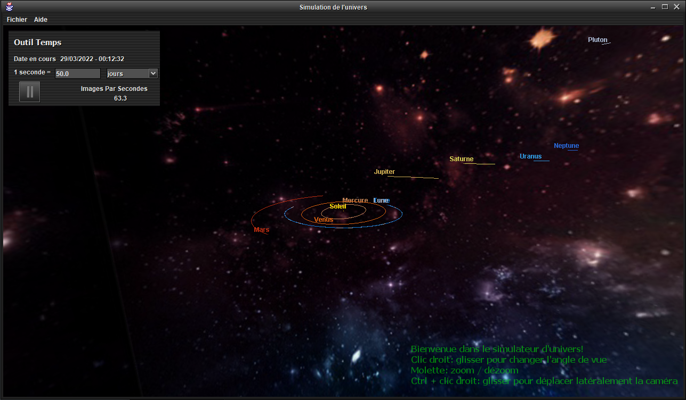

# Universe3D
A sandbox 3D n-body simulator to visualize gravity acting on planets and stars, made in Java with OpenGL.

This was my capstone project for the "Sciences Informatiques et Mathématiques" program at Cégep Maisonneuve in Montreal in 2014. 

## How to run
Double-click the executable jar `bin/App06SimulateurUnivers_Final.jar`

Only tested on Windows.

## Screenshot

